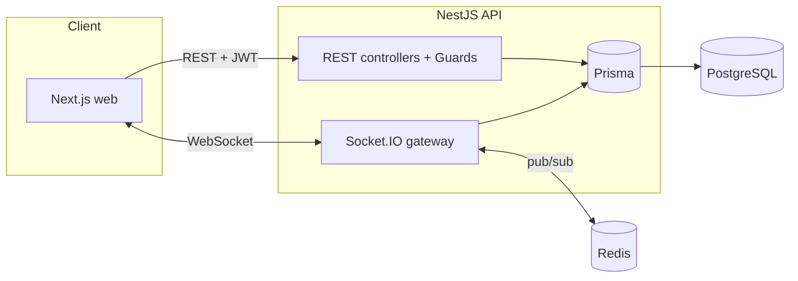

<h1 align="center">Flowdeck</h1>

<p align="center">
  A multi-tenant project-management SaaS (Jira / Linear-style) — built to production standards.<br/>
  <strong>Organizations → Projects → Boards → Columns → Tasks</strong>, with real-time collaboration.
</p>

<p align="center">
  
  
  
  
  
  
  
</p>

---

## What is Flowdeck?

Flowdeck is a **multi-tenant** team collaboration platform where many independent organizations
share one deployment but are fully isolated from each other's data. It's built as a portfolio
project to demonstrate **senior-level full-stack + DevOps** practices end to end — not just CRUD,
but the architecture, security, and operations that real SaaS requires.

> **Multi-tenancy model:** pooled — one database, one schema, `organizationId` as the tenant
> discriminator. Isolation is enforced at the application layer via a membership guard, with
> Postgres Row-Level Security planned as a database-level backstop.

---

## Highlights

- 🏢 **Multi-tenancy** — organizations with per-org membership; a user can belong to many orgs with a different role in each.
- 🔐 **Authentication** — email/password with **bcrypt**, **JWT access + refresh tokens** with **rotation** and server-side revocation.
- 🛡️ **RBAC + tenant isolation** — a single guard enforces both "are you a member of this org?" **and** "do you have the right role?" (`OWNER` / `ADMIN` / `MEMBER` / `VIEWER`). Cross-tenant access returns `403` / `404` by design.
- ✉️ **Invitations** — invite by email with a signed, expiring, single-use token; accepting joins the org atomically.
- 📋 **Kanban domain** — Projects → Boards → Columns → Tasks, fully nested and tenant-scoped.
- ↕️ **Drag-and-drop ordering** — tasks carry an explicit `position`; the move endpoint renumbers neighbors **atomically in a transaction**.
- 🔴🟢 **Real-time** — a **Socket.IO** gateway broadcasts task changes to everyone viewing a board (room-per-board), authenticated by JWT handshake, scaled horizontally with a **Redis pub/sub adapter**.
- 🚢 **DevOps** — multi-stage **Dockerfile**, a full **docker-compose** stack (api + Postgres + Redis), and a **GitHub Actions** CI/CD pipeline (lint → typecheck → test → build → push image).

---

## Architecture



**Request → change → broadcast:** a task move comes in over REST, is validated + authorized by
guards, committed to Postgres in a transaction, and _then_ broadcast over WebSockets (through
Redis, so it reaches clients on every API instance) to everyone watching that board.

---

## Tech stack

| Area               | Choices                                                     |
| ------------------ | ----------------------------------------------------------- |
| Backend            | NestJS 11, TypeScript                                       |
| Database           | PostgreSQL 16, Prisma 7 (driver adapters)                   |
| Real-time          | Socket.IO + `@socket.io/redis-adapter`                      |
| Cache / pub-sub    | Redis 7                                                     |
| Auth               | Passport (JWT access + refresh strategies), bcrypt          |
| Validation         | class-validator + global ValidationPipe                     |
| Tooling            | pnpm workspaces (monorepo), ESLint, Prettier                |
| DevOps             | Docker (multi-stage), docker-compose, GitHub Actions → GHCR |
| Frontend (next up) | Next.js (App Router), Tailwind CSS, shadcn/ui               |

---

## Getting started

**Prerequisites:** Node 20+, pnpm, Docker Desktop.

```bash
# 1. Install dependencies
pnpm install

# 2. Start Postgres + Redis
pnpm db:up

# 3. Set up the API environment
cp apps/api/.env.example apps/api/.env      # then fill in the values

# 4. Apply the database schema
cd apps/api && npx prisma migrate deploy && cd ../..

# 5. Run the API (http://localhost:3001)
pnpm dev:api
```

**Run the whole stack in containers instead:**

```bash
docker compose up -d --build
```

**Explore the API:** import the Postman collection in [`postman/`](./postman) — it includes every
endpoint with auto-saved auth tokens and a Socket.IO request to watch live events.

---

## Project structure

```
flowdeck/
├── apps/
│   ├── api/          # NestJS backend
│   │   ├── src/
│   │   │   ├── auth/           organizations/   invitations/
│   │   │   ├── projects/       boards/          columns/   tasks/
│   │   │   ├── realtime/       # Socket.IO gateway + Redis adapter
│   │   │   └── prisma/
│   │   ├── prisma/   # schema + migrations
│   │   └── Dockerfile
│   └── web/          # Next.js frontend (in progress)
├── postman/          # importable API collection + environment
├── docs/             # requirements + full project guide
├── docker-compose.yml
└── .github/workflows/ci.yml
```

See [`docs/PROJECT_GUIDE.md`](./docs/PROJECT_GUIDE.md) for a deep dive into every decision and concept.

---

## Roadmap

- [x] Auth (register/login, JWT access + refresh with rotation)
- [x] Organizations, memberships, invitations (multi-tenancy + RBAC)
- [x] Projects → Boards → Columns → Tasks (with drag-drop ordering)
- [x] Real-time board updates (Socket.IO + Redis)
- [x] Dockerized + CI/CD pipeline
- [ ] **Frontend** — Next.js board UI with live drag-and-drop
- [ ] Notifications, comments, file attachments
- [ ] Postgres Row-Level Security (DB-level tenant isolation)
- [ ] Observability (structured logs, metrics, tracing)

---

<!-- <p align="center"><em>Built as a learning-in-public project. Frontend coming next.</em></p> -->
